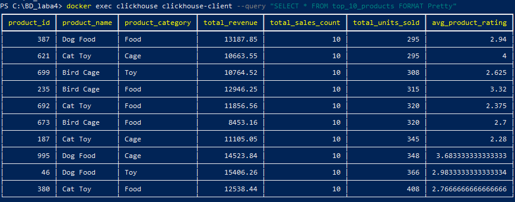

# Лабораторная работа №4 - ETL с помощью Trino

---

## Цель работы

Реализовать ETL с помощью Trino, который трансформирует данные из источников ClickHouse и PostgreSQL в модель данных "снежинка/звезда" в ClickHouse, а затем создать 6 аналитических отчетов.

---


## 1. Архитектура решения

```
┌─────────────────┐     ┌─────────────────┐
│   PostgreSQL    │     │   ClickHouse    │
│  (5 файлов =    │     │  (5 файлов =    │
│   5000 строк)   │     │   5000 строк)   │
└────────┬────────┘     └────────┬────────┘
         │                       │
         └───────────┬───────────┘
                     ▼
              ┌─────────────┐
              │    Trino    │
              │   (ETL)     │
              └──────┬──────┘
                     ▼
              ┌─────────────┐
              │  ClickHouse │
              │ (модель     │
              │  звезда)    │
              └─────────────┘
                     ▼
         ┌───────────────────────┐
         │    6 аналитических     │
         │       отчетов          │
         └───────────────────────┘
```

---

## 2. Модель данных "Звезда"

### Таблица фактов: `fact_sales`

| Колонка | Тип | Описание |
|---------|-----|----------|
| date_id | UInt32 | Ссылка на дату |
| customer_id | UInt32 | Ссылка на клиента |
| product_id | UInt32 | Ссылка на продукт |
| store_id | UInt32 | Ссылка на магазин |
| supplier_id | UInt32 | Ссылка на поставщика |
| quantity | UInt16 | Количество |
| total_price | Decimal(15,2) | Общая сумма |

### Таблицы измерений

| Таблица | Описание |
|---------|----------|
| `dim_date` | Календарные даты (год, месяц, день, день недели) |
| `dim_customer` | Данные о клиентах (ФИО, страна, возрастная группа) |
| `dim_product` | Данные о продуктах (категория, бренд, рейтинг) |
| `dim_store` | Данные о магазинах/продавцах |
| `dim_supplier` | Данные о поставщиках |

---

## 3. Структура проекта

```
C:\BD_laba4\
├── data/                          # Данные контейнеров (игнорируется Git)
├── trino/etc/catalog/             # Конфигурация Trino
│   ├── postgresql.properties
│   └── clickhouse.properties
├── scren/                         # Скриншоты результатов
├── docker-compose.yml             # Запуск всех контейнеров
├── init_postgres.sql              # Создание таблицы в PostgreSQL
├── init_clickhouse.sql            # Создание таблицы в ClickHouse
├── MOCK_DATA_1.csv ... MOCK_DATA_10.csv  # Исходные данные
├── etl_transform.sql              # ETL трансформация
└── create_reports.sql             # Создание отчетов
```

---

## 4. Инструкция по запуску

### 4.1 Запуск контейнеров

```powershell
cd C:\BD_laba4
docker-compose up -d
```

### 4.2 Загрузка данных в PostgreSQL

```powershell
docker cp MOCK_DATA_1.csv postgres:/MOCK_DATA_1.csv
docker exec postgres psql -U admin -d sales_db -c "\COPY mock_data FROM '/MOCK_DATA_1.csv' DELIMITER ',' CSV HEADER"
# Повторить для файлов 2-5
```

### 4.3 Копирование данных из PostgreSQL в ClickHouse через Trino

```powershell
docker exec trino trino --execute "DROP TABLE IF EXISTS clickhouse.default.mock_data"
docker exec trino trino --execute "CREATE TABLE clickhouse.default.mock_data AS SELECT * FROM postgresql.public.mock_data"
```

### 4.4 Создание модели звезда и отчетов

```powershell
# Выполнение ETL
docker exec clickhouse clickhouse-client --query "CREATE TABLE fact_sales ..."

# Создание отчетов
docker exec clickhouse clickhouse-client --query "CREATE TABLE top_10_products ..."
docker exec clickhouse clickhouse-client --query "CREATE TABLE top_10_customers ..."
docker exec clickhouse clickhouse-client --query "CREATE TABLE sales_by_time ..."
docker exec clickhouse clickhouse-client --query "CREATE TABLE top_5_stores ..."
docker exec clickhouse clickhouse-client --query "CREATE TABLE top_5_suppliers ..."
docker exec clickhouse clickhouse-client --query "CREATE TABLE top_bottom_rated_products ..."
```

---

## 5. Созданные отчеты

### Отчет №1: Витрина продаж по продуктам

```sql
SELECT * FROM top_10_products;
```

**Результаты:**
- Топ-10 продуктов по объему продаж
- Общая выручка по каждому продукту
- Средний рейтинг продукта

### Отчет №2: Витрина продаж по клиентам

```sql
SELECT * FROM top_10_customers;
```

**Результаты:**
- Топ-10 клиентов по сумме покупок
- Количество покупок и средний чек

### Отчет №3: Витрина продаж по времени

```sql
SELECT * FROM sales_by_time;
```

**Результаты:**
- Месячные тренды продаж
- Общая выручка по месяцам 2021 года
- Средний размер заказа по месяцам

### Отчет №4: Витрина продаж по магазинам

```sql
SELECT * FROM top_5_stores;
```

**Результаты:**
- Топ-5 магазинов по выручке
- Распределение по странам и городам

### Отчет №5: Витрина продаж по поставщикам

```sql
SELECT * FROM top_5_suppliers;
```

**Результаты:**
- Топ-5 поставщиков по выручке
- Средняя цена товаров

### Отчет №6: Витрина качества продукции

```sql
SELECT * FROM top_bottom_rated_products;
```

**Результаты:**
- Продукты с наивысшим (≥4.5) и наименьшим (≤2.0) рейтингом
- Объем продаж по каждому продукту
- Связь между рейтингом и продажами

---

## 6. Скриншоты результатов

### Все таблицы в ClickHouse

.png)

### Отчет 1: Топ-10 продуктов



### Отчет 2: Топ-10 клиентов

.png)

### Отчет 3: Продажи по времени

.png)

### Отчет 4: Топ-5 магазинов

.png)

### Отчет 5: Топ-5 поставщиков

.png)

### Отчет 6: Качество продукции (топ и нижние рейтинги)

.png)

---

## 7. Выводы

В ходе выполнения лабораторной работы были достигнуты следующие результаты:

1. **Развернута инфраструктура** из трех Docker контейнеров (PostgreSQL, ClickHouse, Trino)

2. **Загружены исходные данные** из 10 CSV файлов (10000 строк) в PostgreSQL и ClickHouse

3. **Реализована ETL трансформация** с помощью Trino, преобразующая данные в модель "звезда"

4. **Созданы 6 аналитических отчетов** (витрин данных) в ClickHouse:

| № | Отчет | Таблица |
|---|-------|---------|
| 1 | Топ-10 продуктов | `top_10_products` |
| 2 | Топ-10 клиентов | `top_10_customers` |
| 3 | Продажи по времени | `sales_by_time` |
| 4 | Топ-5 магазинов | `top_5_stores` |
| 5 | Топ-5 поставщиков | `top_5_suppliers` |
| 6 | Качество продукции | `top_bottom_rated_products` |
